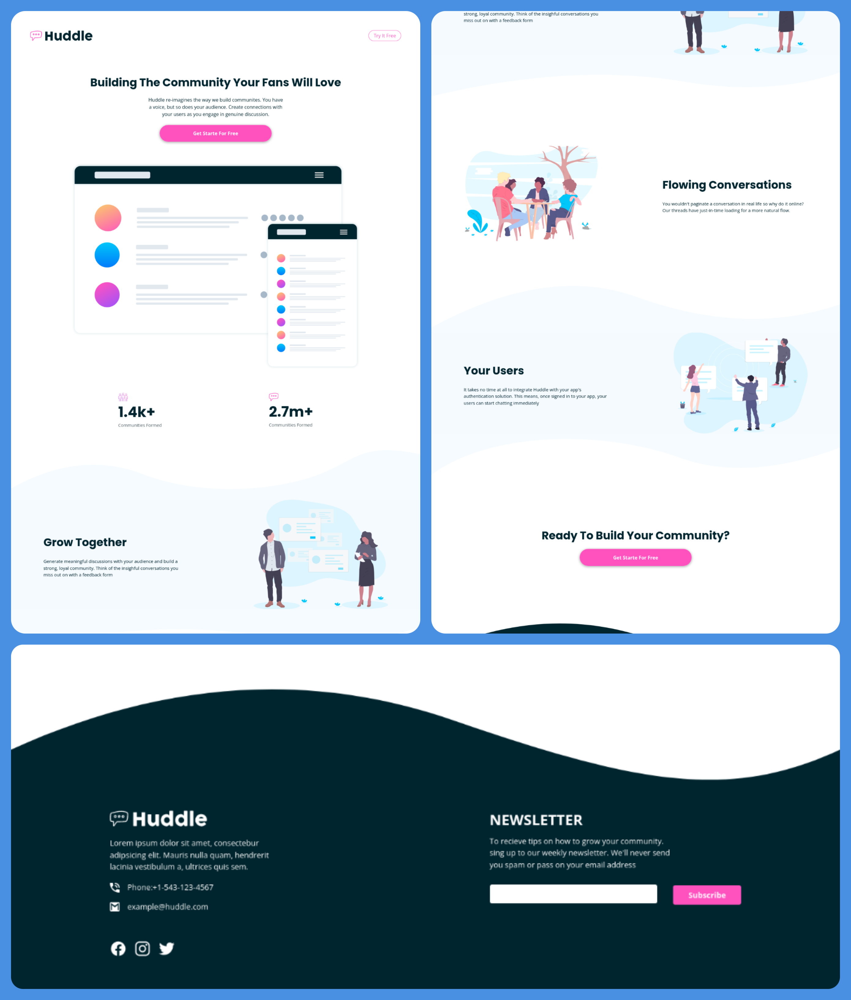
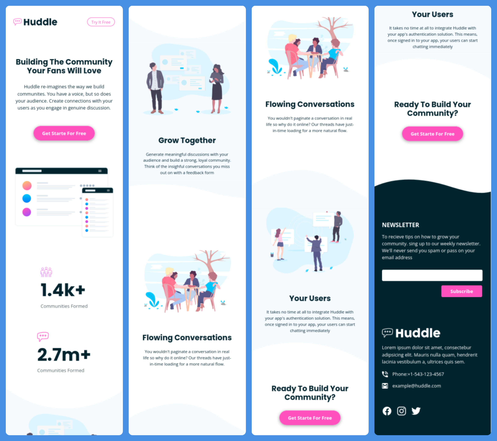

# Frontend Mentor - Huddle landing page with curved sections solution

This is the [Huddle landing page with curved sections challenge on Frontend Mentor](https://www.frontendmentor.io/challenges/huddle-landing-page-with-curved-sections-5ca5ecd01e82137ec91a50f2).

## Table of contents

- [Overview](#overview)
  - [The challenge](#the-challenge)
  - [Screenshot](#screenshot)
  - [Links](#links)
- [My process](#my-process)
  - [Built with](#built-with)
  - [What I learned](#what-i-learned)
  - [Continued development](#continued-development)
  - [Useful resources](#useful-resources)
- [Author](#author)
- [Acknowledgments](#acknowledgments)

## Overview

### The challenge

Users should be able to:

- View the optimal layout for the site depending on their device's screen size
- See hover states for all interactive elements on the page

### Screenshot

#### Desktop



#### mobile



### Links

- Solution URL: [This is the solution as seen from Frontend Mentor.](https://www.frontendmentor.io/solutions/javascriptlibrary-flexbox-desktopfirst-mediaqueries-3U5vRE_3NL)
- Live Site URL: [Live solution](https://boudgnosis.github.io/huddle-landing-page-with-curved-sections/)

## My process

### Built with

- Semantic HTML5 markup
- CSS custom properties
- Flexbox
- Transitions
- Accessibility
- Desktop-first workflow
- Media queries
- Pseudo-classes
- JavaSCript vanilla for fixed menu
- [ScrollReveal](https://scrollrevealjs.org/) - JS library
- [Ionicons](https://ionic.io/ionicons) - Open-source icon set
- [Google Fonts](https://fonts.google.com/) - Interactive directory of typefaces
- [Normalize](https://necolas.github.io/normalize.css/) - It makes browsers render all elements more consistently and according to modern standards.

### What I learned

I learned how to use a JavaScript library that allows me to add effects as I scroll through my website.

```javascript
window.sr = ScrollReveal()

sr.reveal('.container__sections-cards', {
	delay: 500,
	origin: 'bottom',
	distance: '-100px'
});
```

To avoid that the **form** tag together with the **submit** button would reload the page, I discovered that **changing the value of submit to button** would avoid the reloading of the web site.

```html
<button type="button">Subscribe</button>
```

### Continued development

I still need to get better at manipulating the DOM so I will go even deeper.

### Useful resources

- [MDN Web Docs](https://developer.mozilla.org/es/) - I tend to use this website a lot, as it usually has clear explanations and I find it easy to navigate.
- [Hola soy Edu](https://youtu.be/bs6WPzeCF7I) - This is a video which shows how to use ScrollReveal in a simple way. | (The video is in Spanish)
- [Stack Overflow](https://es.stackoverflow.com/questions/71301/evitar-refresco-de-p%C3%A1gina-al-enviar-formulario) - A question asked earlier about how to avoid page refresh when submitting a form. | (The post is in Spanish)

## Author

- Codepen - [@boudgnosis](https://codepen.io/boudgnosis)
- Frontend Mentor - [@boudgnosis](https://www.frontendmentor.io/profile/boudgnosis)
- Twitter - [@juan_ariasd](https://twitter.com/juan_ariasd)
- Dev - [@juan_duque](https://dev.to/juan_duque)
- Linkedink - [juan pablo arias duque](https://www.linkedin.com/in/jpariasduque/)
